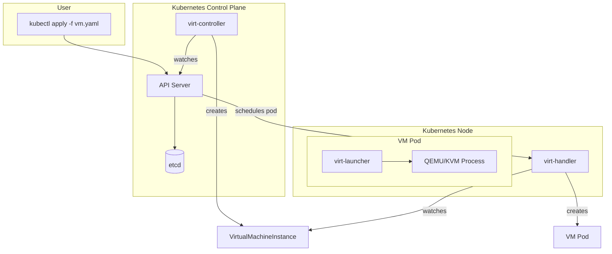

# KubeVirt: Virtual Machines in Kubernetes - A Detailed Explanation

This document provides a comprehensive overview of KubeVirt, its architecture, core components, and how it enables the management of virtual machines (VMs) within a Kubernetes cluster.

## 1. What is KubeVirt?

KubeVirt is an open-source project that extends Kubernetes to provide a complete virtualization API. It allows users to run and manage traditional virtual machines directly alongside modern containerized applications on the same Kubernetes cluster. This capability bridges the gap between legacy workloads that are not easily containerized and cloud-native applications, enabling a single, unified platform for orchestration.

The core mission of KubeVirt is to treat VMs as just another type of application workload in Kubernetes, leveraging the platform's powerful features like scheduling, networking, storage, and monitoring.

**Official Website:** [https://kubevirt.io/](https://kubevirt.io/)

## 2. Why Use KubeVirt? The "Pets" vs. "Cattle" Analogy

In the cloud-native world, applications are often described as "cattle," not "pets."
*   **Pets** are unique, carefully tended, and difficult to replace (e.g., a traditional, manually configured server).
*   **Cattle** are uniform, managed as a group, and easily replaced if one fails (e.g., stateless container replicas).

Kubernetes excels at managing "cattle." KubeVirt's goal is to enable the management of "pet" VMs using the "cattle" model. It allows you to define a VM declaratively, version-control its configuration, and have Kubernetes automatically handle its lifecycle, recovery, and scaling, making it behave more like a cloud-native application.

This is invaluable for:
*   **Legacy Applications:** Migrating applications that cannot be easily refactored into containers.
*   **Mixed Workloads:** Running applications that require both VM and container components (e.g., a custom network appliance VM alongside a web application).
*   **Development & Testing:** Providing developers with self-service, API-driven access to VMs within their Kubernetes namespaces.
*   **Network Function Virtualization (NFV):** Running virtualized network functions (VNFs) on a Kubernetes platform.

## 3. Core Architecture: How It Works

KubeVirt integrates with Kubernetes by using **Custom Resource Definitions (CRDs)**. These CRDs extend the Kubernetes API, introducing new object types for managing virtual machines. The primary CRD is the `VirtualMachine` (VM).

Here is the high-level workflow:

1.  **User Action:** A user defines a `VirtualMachine` in a YAML manifest and applies it using `kubectl apply`.
2.  **API Server:** The Kubernetes API server receives the manifest, validates it against the `VirtualMachine` CRD, and stores it in the `etcd` database.
3.  **KubeVirt Controller (`virt-controller`):** This central component watches the API server for `VirtualMachine` objects. When it sees a new VM, it creates another object called a `VirtualMachineInstance` (VMI). The VMI represents a single, running instance of a VM.
4.  **KubeVirt Handler (`virt-handler`):** This is a daemonset that runs on every node in the cluster. It watches for VMI objects assigned to its node.
5.  **Pod Creation:** The `virt-handler` on the target node takes the VMI definition and translates it into a standard Kubernetes Pod specification. This pod is the "container" that will host the VM.
6.  **VM Launch:** Inside this Pod, a `virt-launcher` process is started. This process reads the VMI spec and uses `libvirtd` to launch a **QEMU/KVM** process. This QEMU process is the actual virtual machine running the guest OS.
7.  **Management:** From this point on, Kubernetes manages the Pod just like any other. If the node fails, the Kubernetes scheduler can restart the VM's pod on another healthy node.

## 4. Key KubeVirt Components

*   **`virt-controller` (Deployment):** The cluster-wide controller responsible for monitoring VM and VMI CRDs and creating the pods that will host the VMs.
*   **`virt-handler` (DaemonSet):** Runs on each node. It is responsible for the lifecycle of VMs on its node, keeping the state of the cluster in sync with the state of the libvirt domain.
*   **`virt-launcher` (Pod):** The primary process inside the VM's pod. It is responsible for launching and managing the QEMU process. It also provides the `libvirtd` domain XML that defines the VM for KVM.
*   **`virt-api` (Deployment):** An API server that provides additional virtualization-specific functions, such as handling console access and VM start/stop commands.
*   **`virtctl` (CLI Tool):** A command-line utility, analogous to `kubectl`, used for managing VMs. It communicates with the `virt-api` to perform actions like `start`, `stop`, `restart`, and connecting to the VM's serial console (`virtctl console`).

## 5. Networking and Storage

KubeVirt leverages standard Kubernetes concepts for networking and storage, ensuring seamless integration.

### Storage
VM disks are backed by **Persistent Volumes (PVs)** and **Persistent Volume Claims (PVCs)**. This means you can use any storage solution that has a Kubernetes storage class provider (e.g., Ceph, GlusterFS, local storage, or cloud provider block storage).

The **Containerized Data Importer (CDI)** is a crucial companion project. It helps import and prepare VM disk images. In our project, the `DataVolume` object is a CDI resource that orchestrates pulling a cloud image from a URL and placing it onto a PVC for the VM to use.

### Networking
By default, a VM's network is handled by a Pod network. KubeVirt uses a `virt-launcher` pod, and the VM attaches to the pod's network namespace.

*   **Default (Pod Networking):** The VM gets an IP address from the same network as the Kubernetes pods. This allows easy communication between VMs and containers.
*   **Secondary Networks (Multus):** For more advanced networking scenarios (e.g., connecting a VM to multiple VLANs or a provider network), KubeVirt integrates with [Multus CNI](https://github.com/k8snetworkplumbingwg/multus-cni). This allows you to attach multiple network interfaces to a single pod, and therefore, to a single VM.

## 6. Summary

KubeVirt successfully virtualizes hardware at the Kubernetes level, not just the OS level (like containers). It provides a powerful and flexible way to manage mixed workloads, offering a clear migration path for legacy applications into a modern, cloud-native infrastructure without requiring immediate and costly refactoring.
